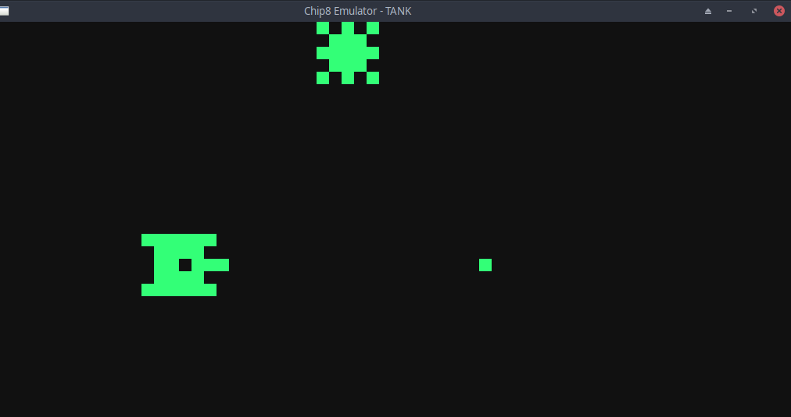

# Chip8 Emulator

A Chip-8 Emulator 

Chip-8 is a programming language for 8-bit computers developed in the 1970s. It is an interpreted language that was intended for game development. It originally ran on the COSMAC VIP and Telmac 1800 computers.


*Tank*


*Brix*


*Pong*

## Compiling

### Installing requirements
It requires the [SDL](https://www.libsdl.org) library for display rendering.

Debian-based
```
$ sudo apt-get install libsdl2-dev
```

Arch-based
```
$ pacman -S sdl2
```

### Compile

```
$ make
```

*Running:*

```
$ ./chip8 <program>
```

There are 26 available programs in the `roms/` directory.
